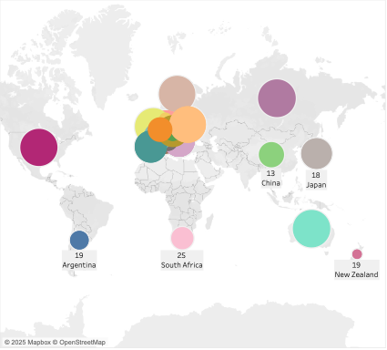
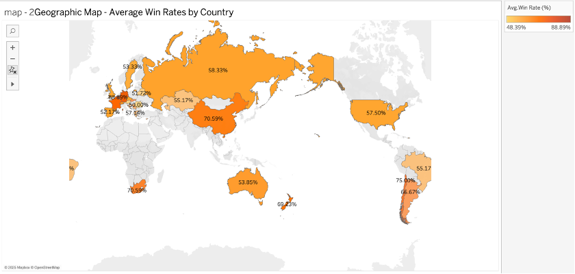

# 🎾 Australian Open 120-Year Performance Visualization

> Tableau-based data visualization project analyzing 120 years of Australian Open performance data.  
> Focused on uncovering long-term trends and player-country performance insights.

---

## 📊 Project Overview

This project visualizes historical Australian Open tennis data (1905–Present), analyzing national, gender, and player-level performance using Tableau dashboards.  
The goal is to identify performance trends, emerging countries, and player dominance patterns over time.

---

## 🎯 Business Questions

- How has national dominance shifted over 120 years of the Australian Open?
- What are the differences in performance between male and female players?
- Which players have demonstrated historical dominance and consistency?

---

## 📂 Dataset Overview

- **Source:** Official Australian Open records (pre-processed dataset)
- **Time Period:** 1905 – Present
- **Features:**
  - Player Name, Country, Gender
  - Number of Wins, Matches Played, Win Rates
  - Titles Won, Runner-up Count, Tournament Participation Years

---

## 📊 Visualization Highlights

### 🗺️ 1. Country-Level Performance

> A world map showing the total number of Australian Open titles by country.

> Geographic distribution of countries based on average win rates.

---

### 🎾 2. Champions and Players Analysis

> Treemap visualizing win rates by individual champions, segmented by gender.

> Scatter plot comparing win rates of top players across 120 years.

---

### 📈 3. Long-Term Trend Analysis

> Line chart visualizing moving average of win rates by gender over 120 years.

---

## 📊 Tableau Public Dashboard

Explore the full interactive dashboard:  
👉 [View Tableau Dashboard](https://public.tableau.com/) <!-- 여기에 본인 링크 붙여넣기 -->

---

## 💡 Key Insights

- Historically, Australia and the USA dominated the Australian Open.
- Emerging nations (Japan, China) are showing increased success in recent decades.
- Women’s players demonstrate higher consistency in win rates over the years.
- Parallel coordinate plots and scatter plots highlight top players’ dominance and consistency.

---

## 📁 Project Files

| Folder / File          | Description                                |
|------------------------|--------------------------------------------|
| `tableau/`             | Tableau workbook file (`.twbx`)            |
| `figures/`             | Key visualizations (PNG images)            |
| `reports/`             | PDF report summarizing analysis            |
| `README.md`            | Project overview and documentation         |

---

## 🛠️ Tools Used

- Tableau Desktop (Data Visualization & Dashboard)
- Excel (Data Preprocessing)

---

## 📦 Deliverables

- Interactive Tableau dashboard (public link)
- 8+ Key visualizations (maps, treemaps, scatter plots)
- PDF report with summary insights
- Tableau workbook file (`.twbx`)

---

📊 Data Visualization ➔ 🎾 Sports Analytics ➔ 📈 Business Insights

