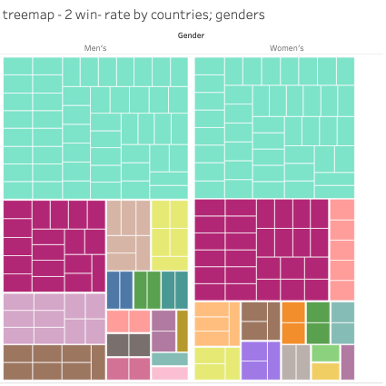
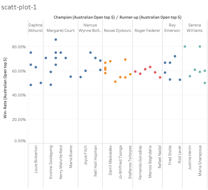
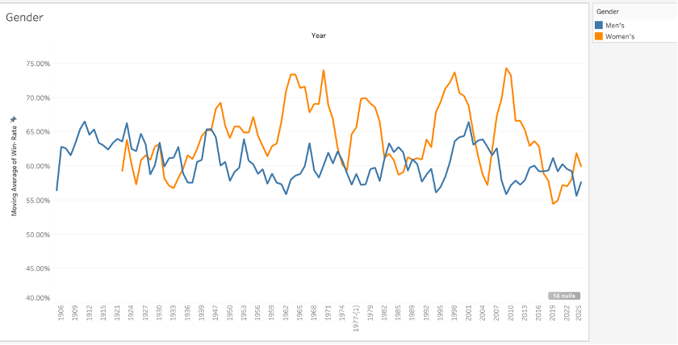

# 🎾 Australian Open 120-Year Performance Visualization

> Tableau-based data visualization project analyzing 120 years of Australian Open performance data.  
> Focused on uncovering long-term trends and player-country performance insights.

---

## 📊 Project Overview

This project visualizes historical Australian Open tennis data (1905–Present), analyzing national, gender, and player-level performance using Tableau dashboards.  
The goal is to identify performance trends, emerging countries, and player dominance patterns over time.

---

## 🧑‍💻 Project Role & Contribution

This is an **independent project** completed by **Chaeeun Lee** as part of a university-level visual analytics report.  
All aspects—data cleaning, transformation, visualization, insight generation, and storytelling—were solely led and developed by the author.

---

## 🎯 Business Questions

- How has national dominance shifted over 120 years of the Australian Open?
- What are the differences in performance between male and female players?
- Which players have demonstrated historical dominance and consistency?

---

## 📂 Dataset Overview

- **Source:** Official Australian Open records (pre-processed dataset)
- **Time Period:** 1905 – Present
- **Features:**
  - Player Name, Country, Gender
  - Number of Wins, Matches Played, Win Rates
  - Titles Won, Runner-up Count, Tournament Participation Years

---

## 🧹 Data Cleaning & Feature Engineering

Preprocessing steps were completed in **Excel** to ensure data compatibility with Tableau and consistency in visual analytics. Tasks included:

- Handling missing values (e.g., seeds, match times) using placeholders like `Not Available` or `0`
- Standardizing player names, country codes, and tournament year formats
- Creating derived features (e.g., win rates, stage-wise results) to enable complex visualizations like parallel coordinates
- Classifying top performers (≥ 5 titles) and segmenting data by gender for deeper comparative analysis

---

## 📊 Visualization Highlights

### 🗺️ 1. Country-Level Performance

> A world map showing the total number of Australian Open titles by country.

> Geographic distribution of countries based on average win rates.

---

### 🎾 2. Champions and Players Analysis

> Treemap visualizing win rates by individual champions, segmented by gender.

> Scatter plot comparing win rates of top players across 120 years.

---

### 📈 3. Long-Term Trend Analysis

> Line chart visualizing moving average of win rates by gender over 120 years.

---

## 💼 Business Impact & Applicability

This project offers strategic value to sports analysts, tennis federations, and sponsorship stakeholders:

- **Talent pipeline identification**: Highlighting countries with emerging champions supports better wildcard and funding decisions.
- **Sponsorship optimization**: Brands can target rising markets for partnership opportunities.
- **Historical benchmarking**: Enables analysts to compare modern athletes with historical legends using consistent metrics.

---

## 📊 Tableau Public Dashboard

Explore the full interactive dashboard:  
👉 [View Tableau Dashboard](https://public.tableau.com/)

---

## 💡 Key Insights

- Historically, Australia and the USA dominated the Australian Open.
- Emerging nations (Japan, China) are showing increased success in recent decades.
- Women’s players demonstrate higher consistency in win rates over the years.
- Parallel coordinate plots and scatter plots highlight top players’ dominance and consistency.

---

## 📁 Project Files

| Folder / File          | Description                                |
|------------------------|--------------------------------------------|
| `tableau/`             | Tableau workbook file (`.twbx`)            |
| `figures/`             | Key visualizations (PNG images)            |
| `reports/`             | PDF report summarizing analysis            |
| `README.md`            | Project overview and documentation         |

---

## 🛠️ Tools Used

- Tableau Desktop (Data Visualization & Dashboard)
- Excel (Data Preprocessing)

---

## 📦 Deliverables

- Interactive Tableau dashboard (public link)
- 8+ Key visualizations (maps, treemaps, scatter plots)
- PDF report with summary insights
- Tableau workbook file (`.twbx`)

---

📊 Data Visualization ➔ 🎾 Sports Analytics ➔ 📈 Business Insights

